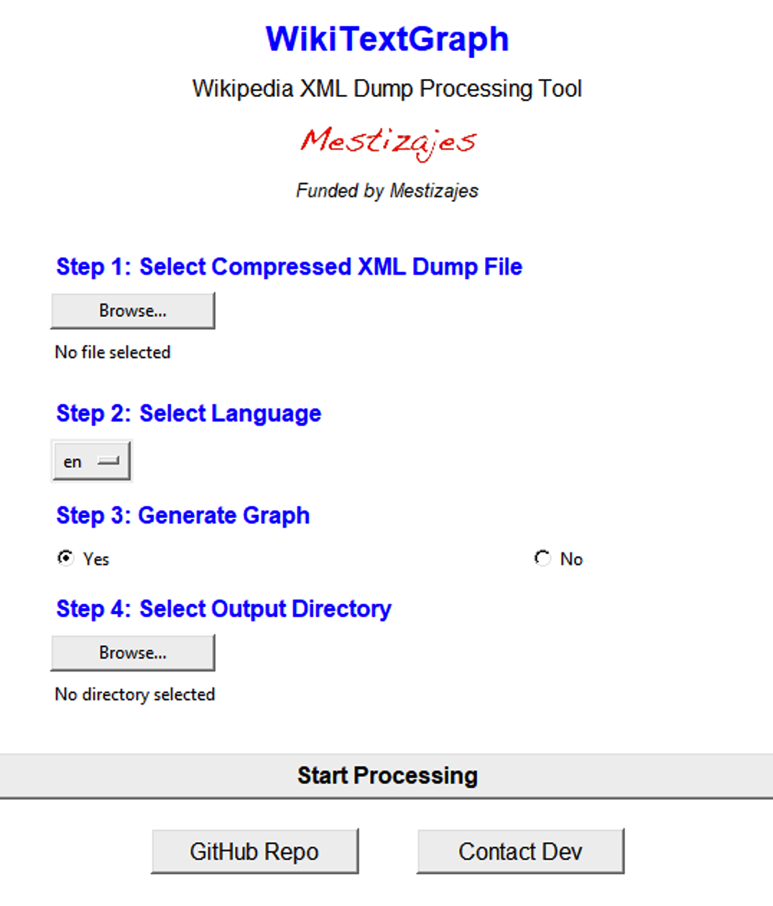

# WikiTextGraph

`WikiTextGraph` is a Python package for parsing Wikipedia dumps, cleaning article texts, and generating graph representations of Wikipedia's link structure. 
It supports multiple languages and provides both command-line and graphical interfaces for ease of use.

## Features

- Parse Wikipedia XML dumps and extract article titles and cleaned text
- Generate graph representations of Wikipedia's link structure
- Resolve redirects to maximize valid links in the final graph
- Support for 9 languages: English (en), Spanish (es), Greek (el), Polish (pl), German (de), Basque (eu), Dutch (nl), Hindi (hi), and Italian (it)
- Extensible language support through configuration
- User-friendly GUI for non-technical users

## Installation

### Prerequisites

- Python 3.8 or higher
- pip package manager

### Installation Steps

1. Clone the repository:
   ```bash
   git clone https://github.com/yourusername/WikiTextGraph.git
   cd WikiTextGraph
   ```

2. Install the package and its dependencies:
   ```bash
   pip install -r requirements.txt
   ```

   This will install all the required dependencies listed in [`requirements.txt`](https://github.com/PaschalisAg/WikiTextGraph/blob/main/requirements.txt).

## Usage

### For Non-Technical Users (GUI)

1. Launch the application:
   ```bash
   python main.py
   ```

2. Follow the steps in the GUI:
   - Step 1: Select the compressed XML dump file (*.bz2)
   - Step 2: Select a base directory for output files
   - Step 3: Select your language from the dropdown
   - Step 4: Choose whether to generate a graph
   - Click "Confirm Selection" to start processing

<p align="center">
  
</p>

### For Technical Users (Command Line)

Use the command-line interface for automation or batch processing:

```bash
python main.py --dump_filepath /path/to/dump.bz2 --language_code EN --base_dir /path/to/output --generate_graph
```

Options:
- `--dump_filepath`: Path to the compressed Wikipedia XML dump file
- `--language_code`: Language code (EN, ES, GR, PL, IT, NL, EUS, HI, DE)
- `--base_dir`: Base directory for output files (defaults to current directory)
- `--generate_graph`: Flag to generate the graph (optional)

You can also use the installed command-line tool:

```bash
wikidump_processor --dump_filepath /path/to/dump.bz2 --language_code EN --generate_graph
```

## Output

The tool creates the following directory structure:

```
base_dir/
└── language_code/
    ├── output/
    │   └── language_code_WP_titles_texts.parquet
    └── graph/
        ├── redirects_rev_mapping.pkl.gzip
        └── language_code_graph_wiki_cleaned.parquet
```

- `language_code_WP_titles_texts.parquet`: Contains the titles and cleaned text of each Wikipedia article
- `redirects_rev_mapping.pkl.gzip`: Mappings for redirect resolution
- `language_code_graph_wiki_cleaned.parquet`: The final graph representation with Source/Target pairs

## Language Support

WikiTextGraph currently supports 9 languages. The language-specific settings are stored in [`LANG_SETTINGS.yml`](https://github.com/PaschalisAg/WikiTextGraph/blob/main/LANG_SETTINGS.yml). 
Each language configuration includes:

- Regular expressions for identifying sections like "References" and "See also" and many other
- Patterns for filtering out non-content pages
- Redirect keywords for identifying redirect pages

To add support for a new language, update the YAML file with the appropriate settings.

## Extending Language Support

To add a new language:

1. Edit [`LANG_SETTINGS.yml`](https://github.com/PaschalisAg/WikiTextGraph/blob/main/LANG_SETTINGS.yml) and add a new entry with:
   - `section_patt`: Regular expression for identifying non-content sections
   - `filter_out_patterns`: Patterns for non-content pages to filter out
   - `redirect_keywords`: Keywords indicating redirect pages

2. Update the language choices in the code (in [`main.py`](https://github.com/PaschalisAg/WikiTextGraph/blob/main/main.py) and [`gui.py`](https://github.com/PaschalisAg/WikiTextGraph/blob/main/gui.py))

3. Pull a request if you want to contribute to this project. We will evaluate your changes and if they align with the objective, we will accept and merge them to the algorithm.

## Technical Details

The processing pipeline consists of:

1. Parsing the XML dump using SAX parsing for memory efficiency
2. Cleaning the text by removing templates, references, and non-content sections
3. Extracting wikilinks from the cleaned text
4. Building a graph representation with articles as nodes and wikilinks as edges
5. Resolving redirects to ensure valid connections
6. Removing duplicate edges and self-loops
7. Saving the final graph data in Parquet format

## Use Cases
To mention a few of them:
- **Network Science Research**
   - Analyze structural properties and community detection in Wikipedia’s knowledge graph across multiple languages.
- **Computational Linguistics**
   - Compare linguistic and semantic coverage among languages to study translation gaps or cross-cultural topics.
- **Knowledge Base Augmentation**
   - Enrich your domain-specific knowledge base by integrating Wikipedia data and link structure as an external resource.

## License

WikiTextGraph is licensed under the **Apache License 2.0**.

Under this license, you are free to:

- **Use** the software for any purpose.
- **Modify** and distribute the software.
- **Integrate** it into your own projects.
- **Commercialize** derived works.

However, the following conditions apply:

- **Attribution**: You must provide appropriate credit to the original authors, include the license notice, and indicate if changes were made.
- **No Warranty**: The software is provided "as is," without any express or implied warranties.
- **Patent Grant**: If you contribute to the project, you grant a license to use any of your patents related to the contributed code.

For full details, see the [Apache License 2.0](https://www.apache.org/licenses/LICENSE-2.0).

## Contributing

Contributions via pull requests, issue reports, and feature suggestions are highly encouraged. 
Please adhere to established coding guidelines and conventions. 
If you find a bug or have a request, open a GitHub issue with a clear description.

## Citation

If you use WikiTextGraph in your research, we kindly request that you cite this repository:

```latex
@misc{WikiTextGraph,
  author = {Paschalis Agapitos, Juan Luis Suárez, Gustavo Ariel Schwartz},
  title = {WikiTextGraph: A Multi-Language Wikipedia Graph Parser},
  year = {2025},
  howpublished = {\url{https://github.com/PaschalisAg/WikiTextGraph}},
}
```

## Contact

For questions, suggestions, or collaborations, feel free to open an issue or reach out via email at pasxalisag9@gmail.com. 